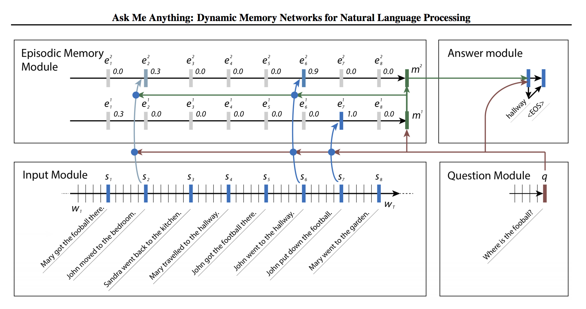

# Dynamic Memory Network

TensorFlow implementation of [Ask Me Anything:
Dynamic Memory Networks for Natural Language Processing](https://arxiv.org/pdf/1506.07285.pdf).




## Requirements

- Python 3.6
- TensorFlow 1.4
- [hb-config](https://github.com/hb-research/hb-config) (Singleton Config)
- nltk (tokenizer and blue score)
- tqdm (progress bar)


## Project Structure

init Project by [hb-base](https://github.com/hb-research/hb-base)

    .
    ├── config                  # Config files (.yml, .json) using with hb-config
    ├── data                    # dataset path
    ├── notebooks               # Prototyping with numpy or tf.interactivesession
    ├── dynamic_memory          # dmn architecture graphs (from input to output)
        ├── __init__.py             # Graph logic
        ├── encoder.py              # Encoder
        └── episode.py              # Episode and AttentionGate
    ├── data_loader.py          # raw_date -> precossed_data -> generate_batch (using Dataset)
    ├── hook.py                 # training or test hook feature (eg. print_variables)
    ├── main.py                 # define experiment_fn
    └── model.py                # define EstimatorSpec      

Reference : [hb-config](https://github.com/hb-research/hb-config), [Dataset](https://www.tensorflow.org/api_docs/python/tf/data/Dataset#from_generator), [experiments_fn](https://www.tensorflow.org/api_docs/python/tf/contrib/learn/Experiment), [EstimatorSpec](https://www.tensorflow.org/api_docs/python/tf/estimator/EstimatorSpec)


## Todo

- Implements DMN+ ([Dynamic Memory Networks for Visual and Textual Question Answering](https://arxiv.org/pdf/1603.01417.pdf) (2016) by C Xiong)


## Config

example: bAbi_task1.yml

```yml
data:
  base_path: 'data/'
  task_path: 'en-10k/'
  task_id: 1
  PAD_ID: 0

model:
  batch_size: 16
  use_pretrained: true             # (true or false)
  embed_dim: 50                    # if use_pretrained: only available 50, 100, 200, 300
  encoder_type: uni                # uni, bi
  cell_type: gru                   # lstm, gru, layer_norm_lstm, nas
  num_layers: 1
  num_units: 32
  memory_hob: 3
  dropout: 0.0
  reg_scale: 0.001

train:
  learning_rate: 0.0001
  optimizer: 'Adam'                # Adagrad, Adam, Ftrl, Momentum, RMSProp, SGD

  train_steps: 100000
  model_dir: 'logs/bAbi_task1'

  save_checkpoints_steps: 1000
  check_hook_n_iter: 1000
  min_eval_frequency: 1000

  print_verbose: False
  debug: False
```


## Usage

Install requirements.

```pip install -r requirements.txt```

Then, prepare dataset and pre-trained glove.

```
sh scripts/fetch_babi_data.sh
sh scripts/fetch_glove_data.sh
```

Finally, start trand and evalueate model
```
python main.py --config bAbi_task1 --mode train_and_evaluate
```

### Experiments modes

:white_check_mark: : Working  
:white_medium_small_square: : Not tested yet.


- :white_check_mark: `evaluate` : Evaluate on the evaluation data.
- :white_medium_small_square: `extend_train_hooks` :  Extends the hooks for training.
- :white_medium_small_square: `reset_export_strategies` : Resets the export strategies with the new_export_strategies.
- :white_medium_small_square: `run_std_server` : Starts a TensorFlow server and joins the serving thread.
- :white_medium_small_square: `test` : Tests training, evaluating and exporting the estimator for a single step.
- :white_check_mark: `train` : Fit the estimator using the training data.
- :white_check_mark: `train_and_evaluate` : Interleaves training and evaluation.

---


### Tensorboar

```tensorboard --logdir logs```


## Reference

- [Implementing Dynamic memory networks](https://yerevann.github.io/2016/02/05/implementing-dynamic-memory-networks/)
- [Ask Me Anything:
Dynamic Memory Networks for Natural Language Processing](https://arxiv.org/pdf/1506.07285.pdf) (2015) by A Kumar


## Author

Dongjun Lee (humanbrain.djlee@gmail.com)
